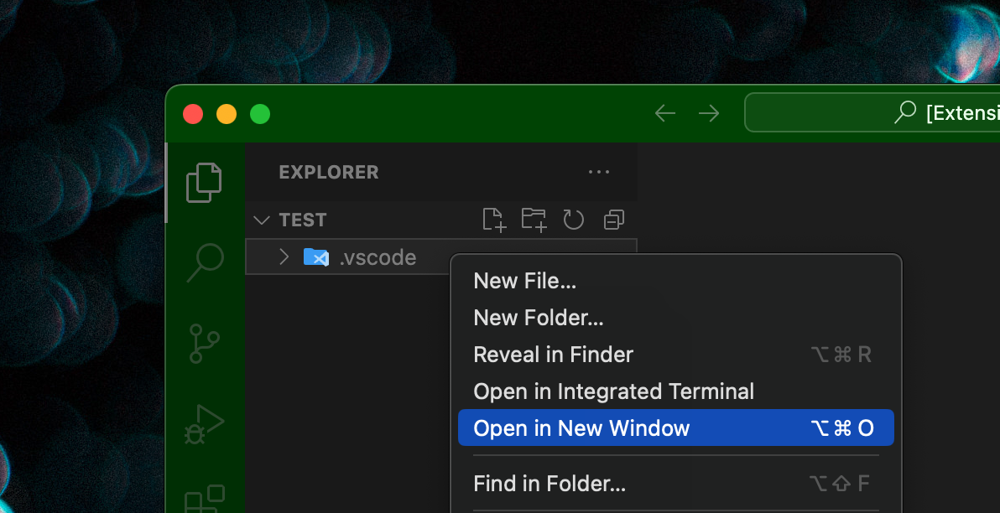

This plugin is simple and gives you an easy way to "open in a new window" from Explorer or an editor. There is one shortcut [ Command + Option + O ] for any operation.

## From the Explorer menu
Add an "Open in New Window" item to the context menu of a right-clicked folder or file in Explorer.

### Keyboard operation is also supported
Keyboard operation is also supported. You can open Explorer in a new window by pressing [ Command + Option + O ] with a file or folder selected using the arrow keys.

## Open a file that is open in the editor.
You can also use the shortcut [ Command + Option + O ] with an active file in the editor to open it in a new window.

----------

このプラグインはシンプルで、エクスプローラやエディタから簡単に「新しいウィンドウで開く」方法を与えます。どの操作にもショートカット [ Command + Option + O ] は一つです。

## エクスプローラのメニューから
エクスプローラのフォルダやファイルを右クリックしたコンテキストメニューに「新しいウィンドウで開く」の項目を追加します。

### キーボード操作にも対応
キーボード操作にも対応しており、エクスプローラを矢印キーを使ってファイルやフォルダを選択している状態で [ Command + Option + O ] で新しいウィンドウで開くことができます。

## エディタで開いているファイルを
また、エディタでアクティブなファイルがある状態でショートカット [ Command + Option + O ] を使用することで、新規ウィンドウで開くことができます。
